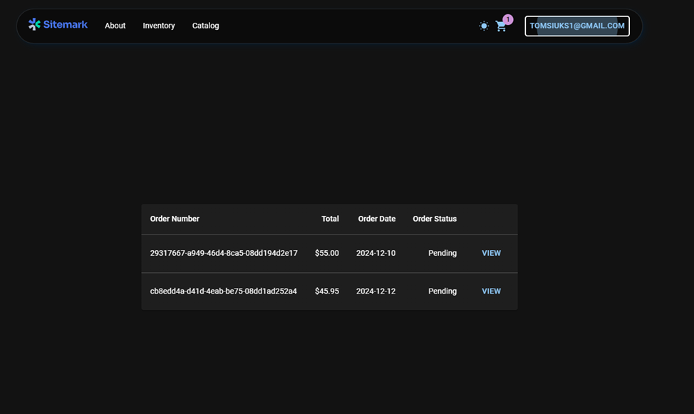

## Auto dalių parduotuvė

Internetinę automobilių dalių parduotuvę AutoPartsShop, kuri leidžia vartotojams peržiūrėti, filtruoti ir pirkti automobilių dalis internetu. Sistema taip pat suteikia administratoriui galimybę valdyti inventorių, pridėti naujas prekes, redaguoti esamas ir tvarkyti užsakymus.

### Funkciniai reikalavimai

Neregistruotas sistemos naudotojas gales:

* Peržiūrėti sistemos pradinį puslapį.
* Prisijungti/Registruotis į sistemą.

Registruotas naudotojas galės:

* Peržiūrėti katalogą.
* Dėti prekes į krepšelį.
* Atsiskaityti.

Registruotas Admin naudotojas galės:

* Viską ką registruotas naudotojas.
* Pridėti naujas prekes į katalogą.

Papildomi reikalavimai

1.Prekių katalogas:
* Vartotojai gali peržiūrėti automobilių dalių sąrašą su nuotraukomis, kainomis ir aprašymais.
* Prekių sąrašas palaiko puslapiavimą.
2.Filtravimas ir rūšiavimas:
* Vartotojai gali filtruoti prekes pagal prekės ženklą, tipą ar kitus parametrus.
* Galimybė rūšiuoti prekes pagal kainą, pavadinimą ar kitus kriterijus.
3.Prekių paieška:
* Įgyvendinta prekių paieškos funkcija pagal raktinius žodžius.
4.Krepšelis ir užsakymas:
* Vartotojai gali pridėti prekes į krepšelį ir pateikti užsakymą.
* Integruota mokėjimų sistema naudojant Stripe platformą.
5.Vartotojų autentifikacija:
* JWT žetonų naudojimas saugiam vartotojų autentifikavimui.
6.Inventoriaus valdymas (administratoriams):
* Administratoriai gali kurti, redaguoti ir trinti prekes.
* Speciali sąsaja prekių valdymui su forma prekių kūrimui ir redagavimui.

### Sistemos realizacijai naudojamos technologijos

* Front end – React.js (Javascript)
* Back end – .Net
* DataBase – SQL Server

### GUI dizainas

